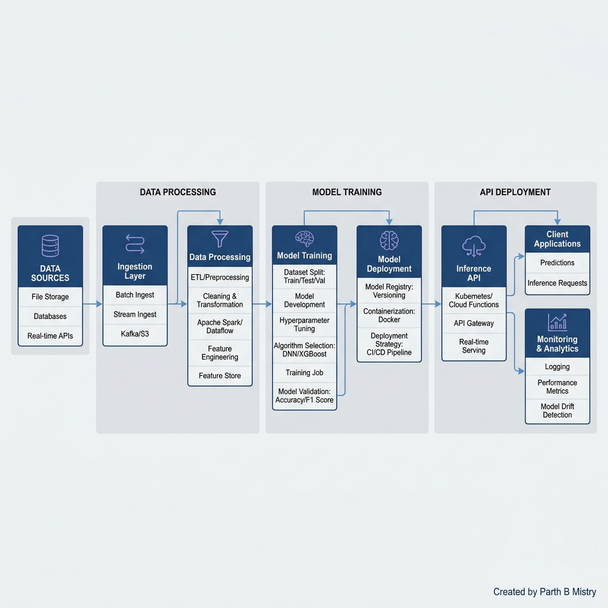

# 👔 Employee Performance Predictor

**Domain:** HR Analytics & Machine Learning  
**Project Status:** 🟢 Completed  
**Live App Link:** *[Insert your Streamlit/HuggingFace link here after deploying]*  

---

## 2. Tagline
*Predicting workforce capability using structured Machine Learning and intelligent HR data patterns.*

---

## 3. Problem Statement
HR departments often struggle to objectively evaluate and predict employee performance without human bias. Subjective annual reviews frequently miss the underlying, actionable correlations between continuous learning, compensation limits, job satisfaction, and an employee's actual output quality.

---

## 4. Solution Approach
Developed an end-to-end Machine Learning web application utilizing a **Random Forest Classifier** to analyze key HR metrics. To overcome data scarcity, a 30,000-record synthetic dataset was engineered with baked-in, realistic HR correlations (e.g., higher satisfaction + excessive training = higher output). The architecture was decoupled—training the model offline and serving the `.pkl` files through a lightweight Streamlit interface—ensuring hyper-fast, secure cloud deployment.

---

## 5. Tech Stack
* **Language:** Python
* **Machine Learning:** `scikit-learn` (Random Forest, MinMaxScaler)
* **Data Processing:** `pandas`, `numpy`
* **Frontend UI:** `Streamlit`
* **Deployment:** Hugging Face Spaces / Streamlit Community Cloud

---

## 6. Key Features
* 📊 **5-Tier Classification:** Accurately groups employees from "Low" to "Excellent".
* 🧠 **Probability Breakdown:** Real-time bar chart showing the model's confidence across all 5 classes.
* clear **Dynamic Insights engine ("Why this prediction?"):** Automatically explains the logic behind the prediction based on the user's specific inputs (e.g., flagging stagnation if an employee has 0 promotions in 5 years).
* ⚡ **Decoupled Architecture:** ML training occurs strictly offline; the web app only serves the lightweight, pre-trained `.pkl` files.

---

## 7. Impact & Results
* **High Accuracy:** The Random Forest model achieved **93.70% accuracy** on unseen test data, maintaining excellent predictive power while highly compressed.
* **Web-Optimized Deployment:** Crushed the model file size down to **~3 MB** (by lowering the RF to 30 trees and capping learning depth) to easily bypass GitHub's 25MB web upload limit. Total deployment footprint was reduced by >95% by stripping dataset generation from the live server.
* **Objective Evaluation:** Created a completely unbiased baseline tool to assist HR managers in performance reviews and intervention planning.

---

## 8. Architecture & Logic Diagrams

### Data Routing Architecture

### Predictive Decision Tree

---

## 9. Future Add-ons
1. **Live HRIS Integration:** Connect via APIs to Workday or BambooHR for live pipeline scoring.
2. **Flight Risk Prediction:** Add a secondary ML model predicting employee attrition (churn probability) alongside performance.
3. **Remote vs. Hybrid Analytics:** Expand feature engineering to measure the impact of work-from-home days on overall output.

---

## 10. Challenges Faced & Solutions

**Challenge:** The initial iteration of the model suffered from severe class imbalance and "lazy prediction." Because it was acting on purely random un-correlated features, the Random Forest defaulted to predicting "Excellent" (the majority class) 100% of the time, effectively learning nothing.

**How I Solved It:** 
1. **Feature Engineering:** I rewrote the dataset generation script to bake in *realistic* mathematical correlations (e.g., weighting Satisfaction at 35% and Training Hours at 20%). 
2. **Algorithm Tuning:** I implemented `class_weight="balanced"` to force the model to penalize majority-class bias.
3. **Data Scaling:** Enlarged the dataset to 30,000 records and decreased the noise variance (`σ=0.03`), creating sharper decision boundaries for the model to capture.
